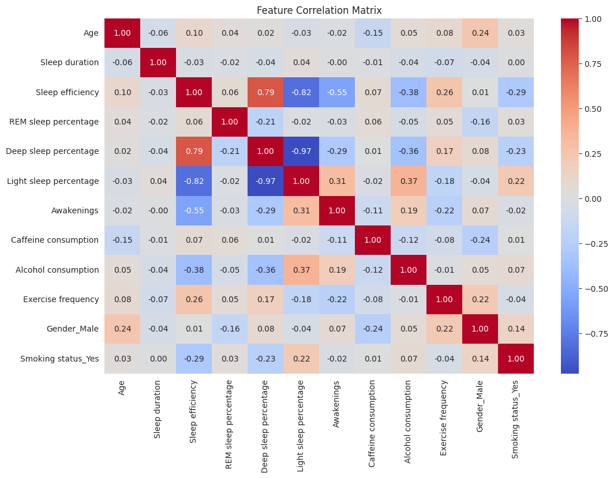
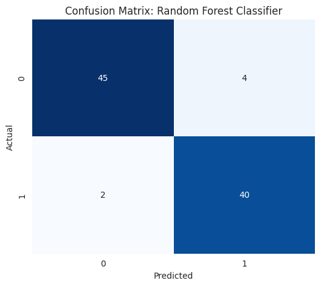
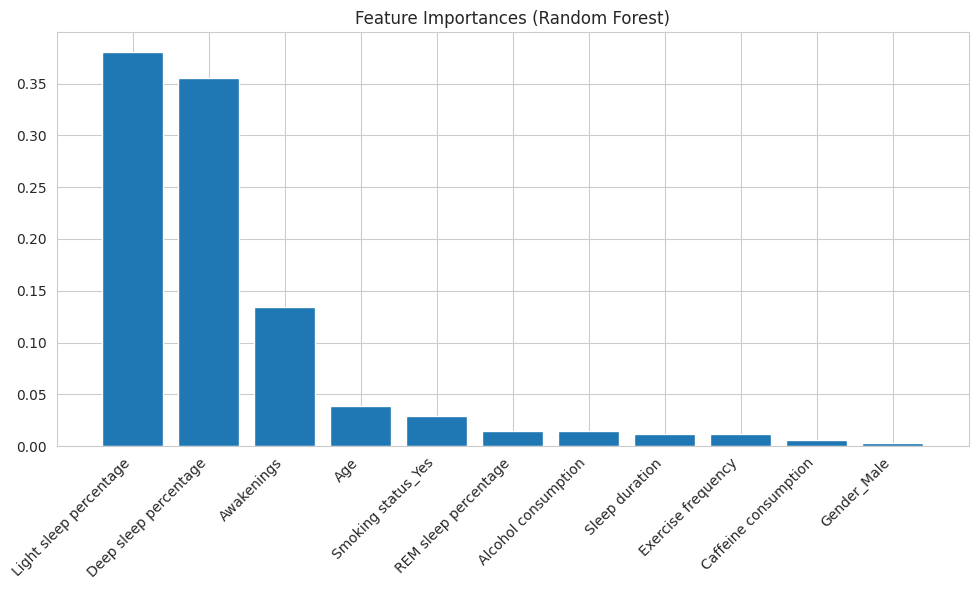
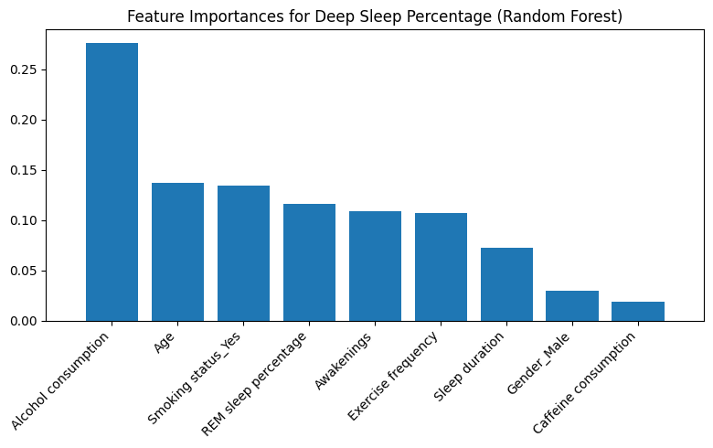
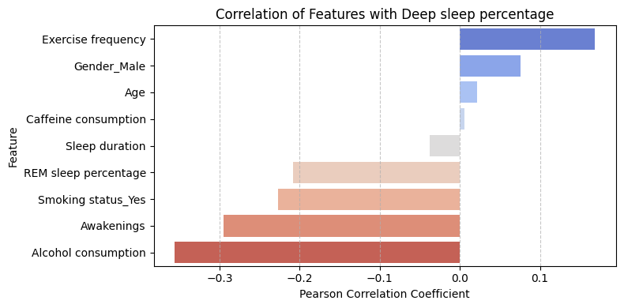

# Sleep Efficiency Analysis and Prediction

**Course:** DS 3000

**Group Members:** Tyler Lafond, Michael Trbovic, Murede Adetiba, Jakub Drotlef

---

## Project Overview

Sleep quality is an essential part of overall health, and it’s not always easy to measure using lifestyle inputs alone. This project applies machine learning to the **Sleep Efficiency Dataset** to:

- **Predict Sleep Efficiency Score:** A continuous value (0.0–1.0) measuring the ratio of time asleep to time in bed.  
- **Classify Sleep Quality:** Grouping individuals into **High** or **Low** efficiency categories.  
- **Identify Key Drivers:** Understanding which physiological and lifestyle factors have the strongest influence on sleep quality.

---

## Dataset

**Source:** Kaggle – Sleep Efficiency Dataset  
**Size:** 452 observations  

**Features include:**

- **Demographics:** Age, Gender  
- **Physiological:** REM sleep %, Deep sleep %, Light sleep %, Awakenings  
- **Lifestyle:** Caffeine consumption, Alcohol consumption, Smoking status, Exercise frequency  
- **Target Variable:** Sleep Efficiency

---

## Exploratory Data Analysis (EDA)

We examined correlations between physiological and lifestyle variables to understand how they relate to sleep efficiency.

**Figure 1: Correlation matrix**



---

## Methodology

We used **5-Fold Cross-Validation** and two modeling tracks.

### **Track 1: Regression (Predicting Efficiency Score)**

Models evaluated:

- **Linear Regression** - **Lasso (L₁)** – for feature selection and regularization  
- **Random Forest** - **XGBoost** - **Neural Network (MLP)** ---

### **Track 2: Classification (High vs. Low Efficiency)**

Target was binned into:

- **High Efficiency:** > 0.85  
- **Low Efficiency:** ≤ 0.85  

Models evaluated:

- **Logistic Regression** - **KNN (k = 5)** - **SVM (RBF Kernel)** - **Random Forest Classifier**

---

## Results & Analysis

### **1. Regression Performance**

| Model               | RMSE | MAE    | R² Score |
|--------------------|------|--------|----------|
| Random Forest      | 0.0512 | 0.0368 | 0.8590 |
| XGBoost            | 0.0570 | 0.0425 | 0.8256 |
| Linear Regression  | 0.0621 | 0.0507 | 0.7930 |
| Lasso (L₁)         | 0.0622 | 0.0510 | 0.7919 |
| Neural Network (MLP) | 0.1213 | 0.0975 | 0.2091 |

**Insight:** Random Forest delivered the best performance, explaining nearly **86%** of the variance.  
The MLP struggled due to the small dataset (452 samples), which typically isn’t enough for deep learning models to converge without heavy tuning.

---

### **2. Classification Performance**

| Model               | Accuracy | CV Mean Acc |
|---------------------|----------|-------------|
| Random Forest Clf   | 0.9341   | 0.8865      |
| SVM (RBF Kernel)    | 0.9231   | 0.8892      |
| Logistic Regression | 0.9121   | 0.8753      |
| KNN (k = 5)         | 0.8571   | 0.8144      |

**Figure 2: Random Forest Confusion Matrix**



**Insight:** Both SVM and Random Forest showed excellent generalization, with accuracy above **93%**.

---

## Key Findings: Feature Importance

Using the Random Forest Regressor, we first identified the physiological drivers of sleep efficiency.

**Figure 3: Feature Importances (Physiological)**



1. **Light sleep % (38.0%)** – Lower values generally align with better efficiency.  
2. **Deep sleep % (35.5%)** – Strongest positive indicator of restful sleep.  
3. **Awakenings (13.4%)** – Frequent disruptions heavily reduce efficiency.

---

## Actionable Insights: Lifestyle Impact

While physiological stages (Deep/Light sleep) determine the score, we analyzed **controllable habits** to answer: *How can one improve their sleep?*

We isolated the lifestyle variables to see which factors specifically drive **Deep Sleep Percentage**.

**Figure 4: Lifestyle Impact Feature Importance**



**Figure 5: Lifestyle Impact Feature Correlation**



Using the correlation graph we can see what kind of effect a factors has, positive or negative, and the feature importance chart shows us how much each feature actually affects the models output.

**Key Drivers of Deep Sleep (Ranked by Importance):**

- **#1 Alcohol consumption (27.57%)** - The biggest disruptor of restorative sleep.
- **#2 Age (13.72%)** - Percent of time in deep sleep lowers with age.
- **#3 Smoking status_Yes (13.38%)** - Smokers showed consistently lower deep sleep metrics.
- **#4 REM sleep percentage (11.62%)** - High REM sleep percentage is a sign of more deep sleep.
- **#5 Awakenings (10.91%)** - Frequently waking means the body can't spend as much time in deep sleep.
- **#6 Exercise frequency (10.71%)**  - Regular physical activity promotes deeper rest.

---

## Usage

To run the analysis:

1. Clone the repository.  
2. Place **Sleep_Efficiency.csv** in the project root.  
3. Ensure the image files are inside the `public/` directory.  
4. Run the Jupyter Notebook or script locally or in Google Colab.

Install dependencies:

```bash
pip install pandas numpy matplotlib seaborn scikit-learn xgboost
